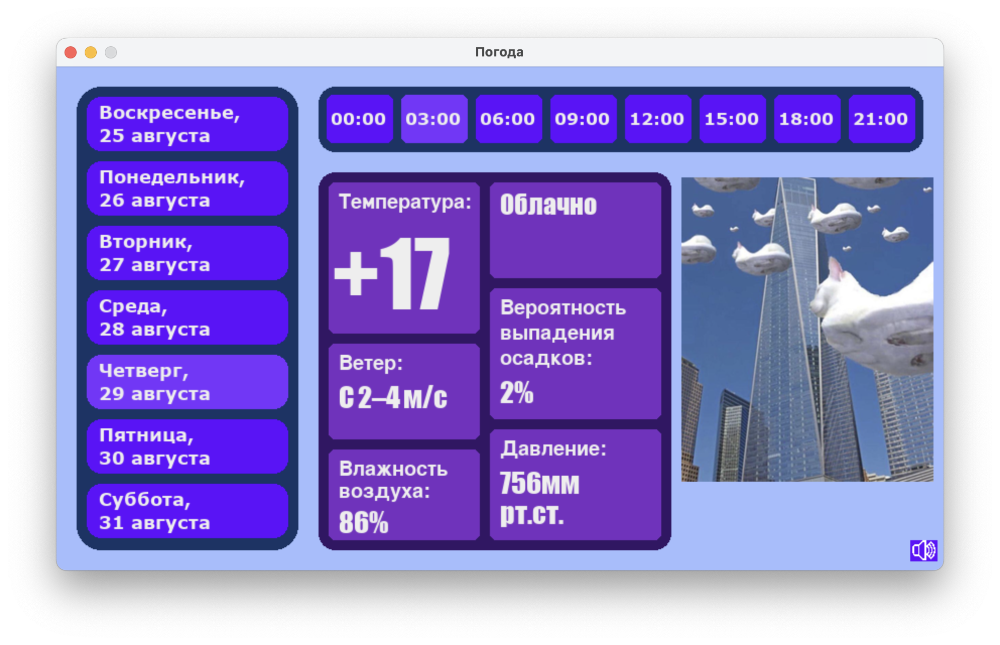

# Weather

## Описание проекта

Проект **"Weather"** представляет собой удобное и функциональное приложение, разработанное на языке Python, которое предоставляет пользователям актуальную информацию о погоде в Калининграде. Парсинг производился с сайта Meteoservice.ru:
https://www.meteoservice.ru/weather/week/kaliningrad#24052024. Приложение сопровождает прогнозы юмористическими мемами и выводит на экран напоминания о погодных условиях. Над проектом работало 4 человека, каждый из которых внёс значительный вклад в его успешную реализацию.

## Установка

### Системные требования

- **Python**: Версия 3.8 или выше.

### Установка зависимостей

Для запуска проекта вам нужно установить необходимые библиотеки. Это можно сделать с помощью следующей команды:

```bash
pip install requests BeautifulSoup4 pygame
```

### Запуск проекта

После установки зависимостей запустите приложение с помощью следующей команды:

```bash
python start.py
```

## Использование

После запуска приложения вы увидите графический интерфейс, где будет отображаться:

- **Прогноз погоды**: Информация о текущей погоде в Калининграде.
- **Мемы**: Юмористические картинки, соответствующие погодным условиям.
- **Напоминания**: Сообщения о важных погодных условиях (например, не забудь свой зонтик!).

### Примеры использования

1. **Выбор даты**: Введите желаемую дату, и приложение покажет прогноз погоды на этот день вместе с соответствующим мемом и напоминанием.
2. **Навигация**: Используйте элементы управления интерфейса для переключения между днями недели и просмотра разных прогнозов.

## Структура проекта

Проект организован следующим образом:

- **`start.py`**: Основной файл для запуска приложения.
- **`parsing.py`**: Модуль для парсинга данных о погоде с помощью библиотеки BeautifulSoup.
- **`images/`**: Каталог, содержащий мемы, которые отображаются в приложении.
- **`font/`**: Каталог, содержащий шрифты, которые отображаются в приложении.
- **`music/`**: Каталог, содержащий музыку, которая отображаются в приложении.

## Технологии

В проекте были использованы следующие технологии:

- **Язык программирования**: Python.
- **Библиотеки**:
  - `requests`: Для получения данных с веб-сайта.
  - `BeautifulSoup4`: Для парсинга данных о погоде с веб-страницы.
  - `pygame`: Для воспроизведения фоновой музыки.

## Демонстрация



